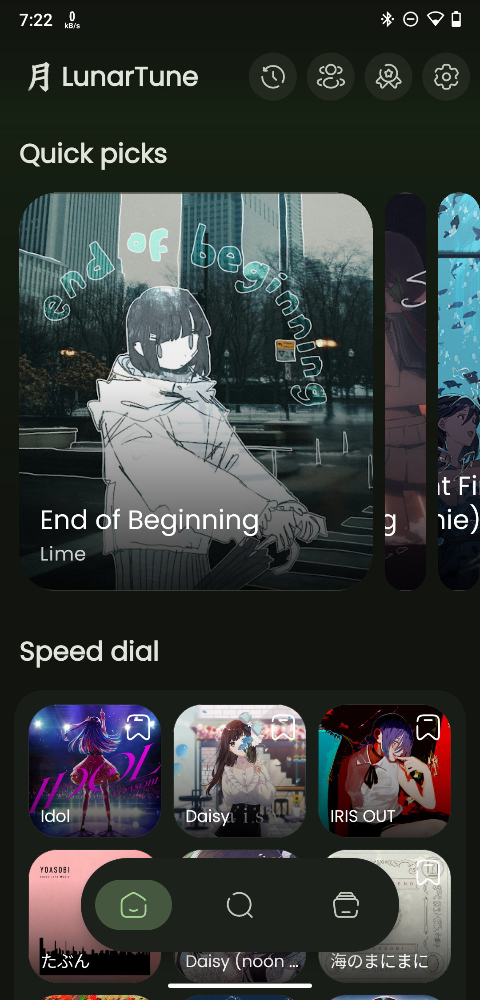
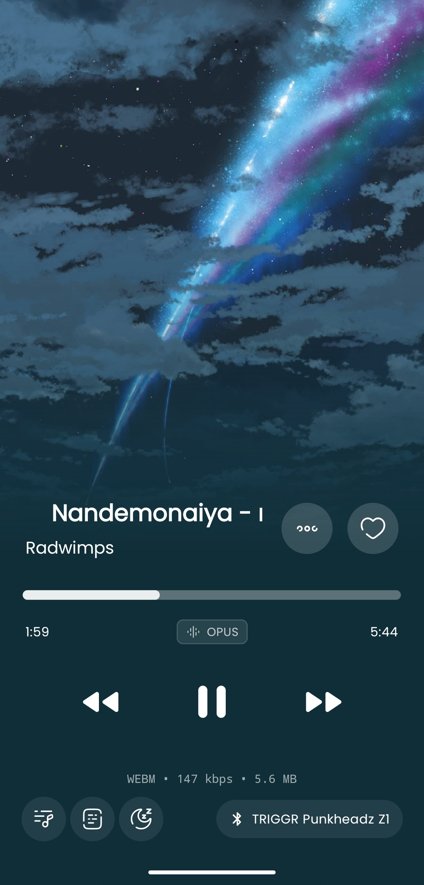
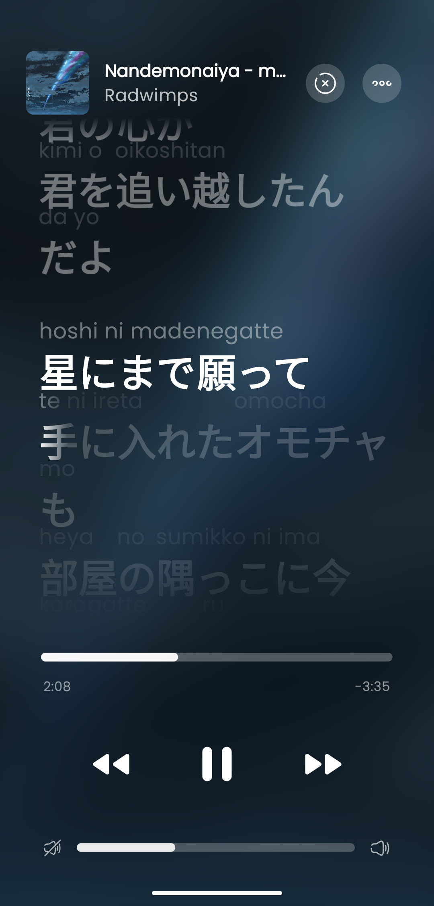
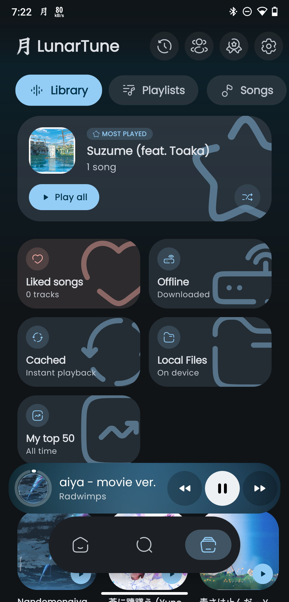
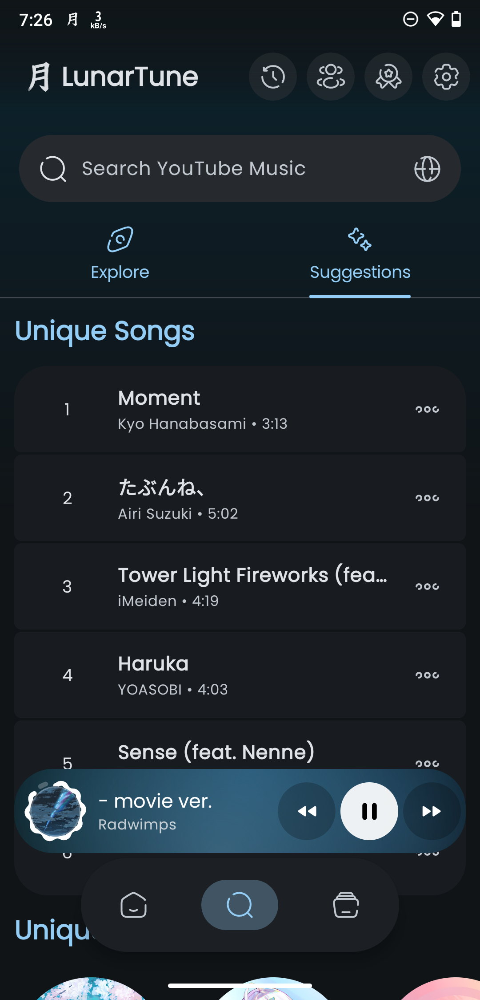
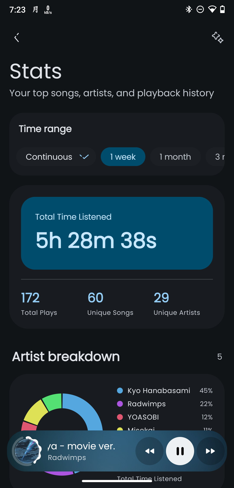
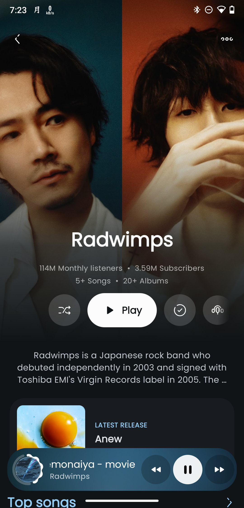
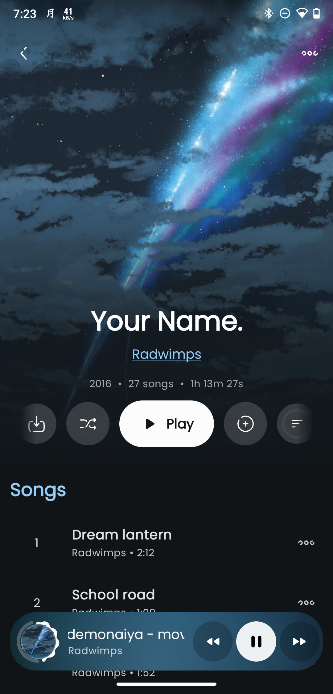
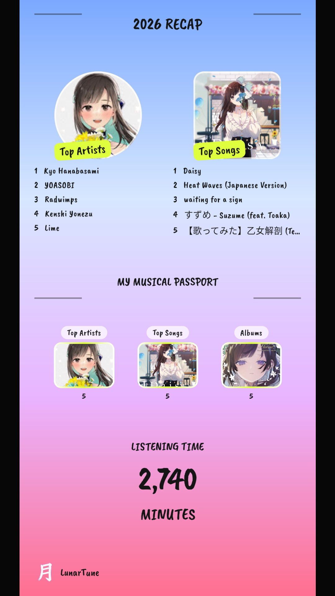

  

  <h1>LunarTune</h1>

  

    
  

  

    <strong>Revamped YouTube Music Experience on Android.</strong>
     
    <em>It’s high-performance, privacy-focused, and packed with features for people who really care about their experience.</em>
  

  

    <a href="https://github.com/cognitiveshadows03/LunarTune/issues/new/choose"><b>Support</b></a>
  

  

    
    
    
    
    
    
    
    
    
    
  

  
   

> [!NOTE]  
> LunarTune is a Custom Vibecoded(currently) fork of Archivetune

---

> [!IMPORTANT]  
> **Geographic Availability:** If YouTube Music is not supported in your region, a VPN or proxy set to a supported region is required for initial data fetching.

---

## 📸 Showcase

---

## ✨ Features

<table>
  <tr>
    <td width="50%" valign="top">
      

        <h3>Playback</h3>
        <ul>
          <li>Multiple account support with quick switching</li>
          <li>Ad-free playback with background listening</li>
          <li>Your playlists, liked songs, and subscriptions appear after sign-in</li>
          <li>Support local file and local song playback
          <li>Fast startup and lightweight performance</li>
          <li>Built for a private, uninterrupted listening experience</li>
        </ul>
      

    </td>
    <td width="50%" valign="top">
      

        <h3>Audio</h3>
        <ul>
          <li>EBU R128 loudness normalization</li>
          <li>Tempo, pitch, and playback speed controls</li>
          <li>Crossfade between tracks</li>
          <li>System equalizer and spatial audio integration</li>
        </ul>
      

    </td>
  </tr>
  <tr>
    <td width="50%" valign="top">
      

        <h3>Lyrics &amp; Discovery</h3>
        <ul>
          <li>Live synced lyrics</li>
          <li>Lyrics translation, AI Lyrics translation and romanization</li>
          <li>Music recognition for songs around you</li>
          <li>Listening statistics whenever you want them</li>
        </ul>
      

    </td>
    <td width="50%" valign="top">
      

        <h3>Sync &amp; Social</h3>
        <ul>
          <li>Import playlist from spotify</li>
          <li>YouTube Music account integration</li>
          <li>Last.fm scrobbling</li>
          <li>ListenBrainz history sync</li>
          <li>Discord rich presence support</li>
        </ul>
      

    </td>
  </tr>
  <tr>
    <td width="50%" valign="top">
      

        <h3>Interface</h3>
        <ul>
          <li>Material 3 design language</li>
          <li>Album-art powered dynamic colors</li>
          <li>Up to 9 different player styles</li>
          <li>Up to 8 different player background styles</li>
          <li>Responsive layouts for different screen sizes</li>
          <li>Clean browsing, player, artist, album, and lyrics views</li>
        </ul>
      

    </td>
    <td width="50%" valign="top">
      

        <h3>Customization</h3>
        <ul>
          <li>Deep playback and interface settings</li>
          <li>Dynamic color theming options</li>
          <li>Gesture customization</li>
          <li>Animation and layout tuning</li>
          <li>Flexible controls to shape the app around your workflow</li>
        </ul>
      

    </td>
  </tr>
</table>

---

## ❓ Need Help or Have Questions?
Join Our Telegram Channels or Discord Servers for Support and Discussion.

---

### 🛠️ Development & Engineering
Interested in building the project or contributing? LunarTune is built on a high-performance Kotlin stack.
<a href="CONTRIBUTING.md"><b>Read the Build & Contribution Guide →</b></a>

---

### Open-Source Acknowledgments

LunarTune is made possible by the work of many open-source projects and communities:
- **ArchiveTune** by [Rukamori](https://github.com/rukamori/ArchiveTune) for base framework.
- **Vivi Music** by [vivizzz007](https://github.com/vivizzz007/vivi-music) for Dolby and Dirac equalizer presets
- **Metrolist** by [Mostafa Alagamy](https://github.com/mostafaalagamy/Metrolist) for Playback client fallback order.
- **SimpMusic** by [maxrave-dev](https://github.com/maxrave-dev/SimpMusic) for the lyrics API provider.
- [BetterLyrics](https://better-lyrics.boidu.dev/) for word-by-word lyrics, unison and artwork provider support.
- [Material Color Utilities](https://github.com/material-foundation/material-color-utilities)
- [Read You](https://github.com/Ashinch/ReadYou) and [Seal](https://github.com/JunkFood02/Seal) for UI component inspiration.
- Translators, beta testers, contributors, and community members who continue to support the project.

---

## ⚖️ Legal Disclaimer

LunarTune is an independent third-party client.
- Not affiliated with Google LLC or YouTube.
- Does not bypass YouTube's technical protections.
- Users are encouraged to support artists by purchasing music via official channels.

## ⚖️ License, Copyright, and Trademark Notice

LunarTune is licensed under the **GNU General Public License v3.0 (GPLv3)**.

You may copy, modify, and redistribute the source code, including commercially, provided that you comply with the GPLv3. This includes preserving applicable copyright and license notices, clearly identifying modified versions, and providing the corresponding source code when required.

Copyright © cognitiveshadows03 and the LunarTune contributors for their respective original contributions.

The **LunarTune™** name, logo, application icon, and official branding are not licensed under the GPLv3. Unofficial forks must not present themselves as official LunarTune releases or imply endorsement by the LunarTune maintainers.

See the [`LICENSE`](LICENSE) file for the complete GPLv3 terms.

---

 

 <b>If LunarTune Improved your music experience, please consider giving us a ⭐</b>

   
